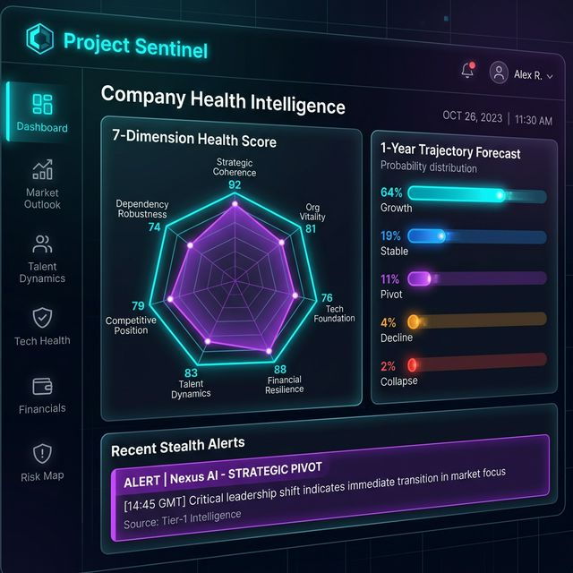

# Project Sentinel: Multi-Agent Intelligence System



Project Sentinel is a sophisticated multi-agent intelligence system designed to synthesize "digital exhaust" and organizational signals into actionable company health insights. It leverages a federated agent architecture to perform deep-dive analysis across strategic, technical, and financial dimensions.

## 🚀 Key Features

- **7-Dimension Health Scoring**: Comprehensive analysis of Strategic Coherence, Org Vitality, Tech Foundation, Financial Resilience, Talent Dynamics, Competitive Position, and Dependency Robustness.
- **Trajectory Forecasting**: Probabilistic forecasting of 1-year company trajectories (Growth, Stable, Pivot, Decline, Collapse).
- **Stealth Alerts**: Real-time detection of stealth signals such as strategic pivots or talent flight.
- **Federated Agents**: Orchestrated AI agents for ingestion, analysis, and synthesis.

## 🛠️ Technology Stack

- **Frontend**: React, Vite, Recharts, Framer Motion, Lucide React
- **Backend**: FastAPI, Uvicorn, Python
- **AI/LLM**: Google Cloud Vertex AI (Gemini 1.5 Pro/Flash)
- **Data & Infrastructure**: Google Cloud BigQuery, Pub/Sub, Cloud Storage, PostgreSQL, SQLAlchemy
- **Analysis**: NetworkX, Pandas, SciPy

## 📦 Getting Started

### Prerequisites

- Node.js & npm
- Python 3.10+
- Google Cloud Platform Account (with Vertex AI enabled)

### Backend Setup

1. Install dependencies:
   ```bash
   pip install -r requirements.txt
   ```
2. Start the API:
   ```bash
   export PYTHONPATH=$PYTHONPATH:.
   uvicorn sentinel.api.main:app --reload
   ```

### Frontend Setup

1. Navigate to the frontend directory:
   ```bash
   cd frontend
   ```
2. Install dependencies:
   ```bash
   npm install
   ```
3. Start the dev server:
   ```bash
   npm run dev
   ```

## 📊 Architecture

Sentinel uses an orchestrator-led pipeline:
1. **IngestionAgent**: Collects signals from various sources.
2. **AnalysisAgent**: Processes signals via NetworkX and statistical models.
3. **SynthesisAgent**: Aggregates findings into the 7-dimension health model.

## 📄 License

MIT
